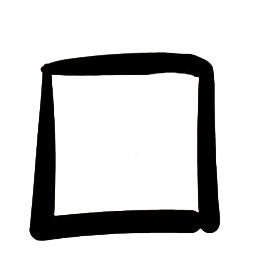

# 📝 Documentation – Simple Todo List

## 📋 Table of Contents

1. [Overview](#overview)
2. [Code Structure](#code-structure)
3. [Global Variables](#global-variables)
4. [Functions](#functions)
5. [Important Concepts](#important-concepts)
6. [Execution Flow](#execution-flow)

---

## 🎯 Overview

This project is a simple todo list application that allows:

- ✅ Create new tasks
- 🔄 Move tasks between "Active" and "Completed"
- 🗑️ Delete tasks
- 🕐 View real-time clock
- 📅 View calendar

---

## 🏗️ Code Structure

```
📦 Project
├── 🌐 Global Variables (DOM elements)
├── 🕐 Clock System
├── 📅 Calendar System
└── ✅ Task System
    ├── Helper Functions
    │   ├── moveToCompleted()
    │   ├── moveToActive()
    │   └── deleteTasks()
    ├── Main Function
    │   └── createTask()
    └── Event Listeners
        ├── Button click
        └── Enter key press
```

---

## 🔧 Global Variables

### DOM Elements

```javascript
const inputTask = document.querySelector("#inputTask");
const button = document.querySelector(".buttonAddTask");
const activeTasks = document.querySelector(".ActiveTasks");
const completedTasks = document.querySelector(".completedTasks");
const divClock = document.querySelector(".clock");
const divCalendar = document.querySelector(".calendar");
```

**Purpose**: Store references to HTML elements for efficient reuse.

**Why in global scope?**

- Used across multiple functions
- Avoids repeated DOM queries (improves performance)
- Fixed elements that don't change during execution

---

## ⚙️ Functions

### 🕐 Clock System

#### `updateClock()`

Updates the clock display every second.

```javascript
function updateClock() {
	const clock = new Date();
	const hour = clock.getHours().toString().padStart(2, "0");
	const min = clock.getMinutes().toString().padStart(2, "0");
	const sec = clock.getSeconds().toString().padStart(2, "0");
	const fullClock = `${hour}:${min}:${sec}`;
	divClock.textContent = fullClock;
}
```

**Execution**:

- Initial call: `updateClock()` - displays immediately
- Automatic update: `setInterval(updateClock, 1000)` - every 1 second

---

### 📅 Calendar System

#### `updateCalendar()`

Updates the date display every minute.

```javascript
function updateCalendar() {
	const now = new Date();
	const day = now.getDate().toString().padStart(2, "0");
	const month = (now.getMonth() + 1).toString().padStart(2, "0");
	const year = now.getFullYear();
	const fullDate = `${day}/${month}/${year}`;
	divCalendar.textContent = fullDate;
}
```

**Execution**:

- Initial call: `updateCalendar()` - displays immediately
- Automatic update: `setInterval(updateCalendar, 60000)` - every 60 seconds

---

### ✅ Task System

#### `moveToCompleted(li, checkbox)`

Moves a task to the completed list.

**Parameters**:

- `li` (HTMLElement): The task's `<li>` element
- `checkbox` (HTMLElement): The checkbox image

**Actions**:

1. Changes checkbox image to "checked"
2. Moves the complete `<li>` to the `completedTasks` list

```javascript
function moveToCompleted(li, checkbox) {
	checkbox.src = "./assets/images/checked.png";
	completedTasks.append(li);
}
```

---

#### `moveToActive(li, checkbox)`

Moves a task back to the active list.

**Parameters**:

- `li` (HTMLElement): The task's `<li>` element
- `checkbox` (HTMLElement): The checkbox image

**Actions**:

1. Changes checkbox image to "unchecked"
2. Moves the complete `<li>` back to `activeTasks`

```javascript
function moveToActive(li, checkbox) {
	checkbox.src = "./assets/images/unchecked.png";
	activeTasks.append(li);
}
```

---

#### `deleteTasks(li)`

Permanently removes a task.

**Parameters**:

- `li` (HTMLElement): The task's `<li>` element

**Action**:

- Completely removes the element from the DOM

```javascript
function deleteTasks(li) {
	li.remove();
}
```

---

#### `createTask()`

Main function that creates a new task.

**Execution flow**:

1. **Validation**: Checks if input is not empty
2. **Element creation**:

   ```javascript
   const li = document.createElement("li");
   const newCheckbox = document.createElement("img");
   const taskContent = document.createElement("span");
   const trash = document.createElement("img");
   const task = document.createElement("div");
   ```

3. **Element configuration**:

   - Sets attributes (`src`, `className`)
   - Sets text content

4. **Event Listeners**:

   - **Checkbox**: Toggles between active/completed
   - **Trash**: Deletes the task

5. **Structure assembly**:

   ```
   li
   ├── task (div)
   │   ├── newCheckbox (img)
   │   └── taskContent (span)
   └── trash (img)
   ```

6. **DOM insertion**: Adds to active tasks list

7. **Cleanup**: Clears input and returns focus

---

## 💡 Important Concepts

### 🔒 Closure

**What is it?**
Closure allows inner functions to "remember" variables from the outer scope, even after the outer function has finished executing.

**In the code**:

```javascript
function createTask() {
	const li = document.createElement("li");
	const newCheckbox = document.createElement("img");

	// This function "captures" li and newCheckbox
	newCheckbox.addEventListener("click", () => {
		// Even after createTask() finishes,
		// this function still has access to li and newCheckbox
		if (li.parentElement === activeTasks) {
			moveToCompleted(li, newCheckbox);
		}
	});
}
```

**Why does it work?**

- Each execution of `createTask()` creates **new elements**
- Each listener keeps a reference to elements **from that specific execution**
- Tasks work independently from each other

---

### 📦 Parameters vs Arguments

**Parameters**: "Empty slots" in the function definition

```javascript
function moveToCompleted(li, checkbox) {
	// li and checkbox are PARAMETERS (placeholders)
}
```

**Arguments**: Actual values passed in the call

```javascript
moveToCompleted(li, newCheckbox);
//               ↑        ↑
//          ARGUMENTS (actual values)
```

**Flow**:

1. Function is defined with empty parameters
2. When called, arguments "fill" the parameters
3. Inside the function, parameters are used as normal variables

**Analogy**:

```javascript
// Function is a form with empty fields
function bills(rent, electricity) {
	console.log(rent + electricity);
}

// Call fills the fields with values
bills(1200, 200); // rent = 1200, electricity = 200
```

---

### 🌳 parentElement

**What is it?**
A DOM property that returns the parent element of an element.

**Hierarchical structure**:

```html
<ul class="ActiveTasks">
	← Parent Element
	<li>
		← Child Element
		
		<span>Task</span>
		
	</li>
</ul>
```

**In the code**:

```javascript
if (li.parentElement === activeTasks) {
	// Checks: "Is this li inside activeTasks?"
}
```

**Practical use**:

- Determines which list the task is in
- Decides whether to move to completed or back to active

---

### 🔄 append() vs appendChild()

| Feature                   | `append()` | `appendChild()`  |
| ------------------------- | ---------- | ---------------- |
| Accepts multiple elements | ✅ Yes     | ❌ No            |
| Accepts strings           | ✅ Yes     | ❌ No            |
| Returns value             | ❌ No      | ✅ Added element |
| Compatibility             | ES6+       | All              |

**Examples**:

```javascript
// append() - Modern and flexible
ul.append(li1, li2, li3);
ul.append("Direct text");

// appendChild() - Traditional
ul.appendChild(li1);
```

---

### 📍 Variable Scope

**When to declare OUTSIDE the function** (global scope):

- Fixed DOM elements
- Containers/structures that don't change
- Variables used across multiple functions

```javascript
const activeTasks = document.querySelector(".ActiveTasks"); // ✅
```

**When to declare INSIDE the function** (local scope):

- Dynamically created elements
- Temporary values
- Multiple instances needed

```javascript
function createTask() {
	const li = document.createElement("li"); // ✅ New on each call
}
```

**Golden rule**:

> If you need to create multiple instances → declare inside the function

---

## 🔄 Execution Flow

### 1️⃣ Task Creation

```
User types in input
       ↓
Clicks button OR presses Enter
       ↓
createTask() is called
       ↓
Validates input (not empty?)
       ↓
Creates elements (li, checkbox, span, trash, div)
       ↓
Configures attributes and content
       ↓
Adds event listeners (checkbox and trash)
       ↓
Assembles structure (append)
       ↓
Inserts into DOM (activeTasks)
       ↓
Clears input and returns focus
```

### 2️⃣ State Toggle (Check/Uncheck)

```
User clicks checkbox
       ↓
Listener detects click
       ↓
Checks: li.parentElement === activeTasks?
       ↓
YES → moveToCompleted(li, checkbox)
  ├─ Changes image to "checked"
  └─ Moves to completedTasks
       ↓
NO → moveToActive(li, checkbox)
  ├─ Changes image to "unchecked"
  └─ Moves to activeTasks
```

### 3️⃣ Task Deletion

```
User clicks trash icon
       ↓
Listener detects click
       ↓
deleteTasks(li) is called
       ↓
li.remove() is executed
       ↓
Element is removed from DOM
```

---

## 🎨 Generated HTML Structure

Each created task generates the following structure:

```html
<ul class="ActiveTasks">
	<li>
		<div class="task">
			
			<span>Task text</span>
		</div>
		
	</li>
</ul>
```

---

## 🚀 Future Improvements

- [ ] Data persistence (localStorage)
- [ ] Task editing
- [ ] Filters (all/active/completed)
- [ ] Task counter
- [ ] Drag and drop to reorder
- [ ] Categories/tags
- [ ] Dark mode

---

## 📚 References

- [MDN - DOM](https://developer.mozilla.org/en-US/docs/Web/API/Document_Object_Model)
- [MDN - Closures](https://developer.mozilla.org/en-US/docs/Web/JavaScript/Closures)
- [MDN - addEventListener](https://developer.mozilla.org/en-US/docs/Web/API/EventTarget/addEventListener)
- [MDN - Element.append()](https://developer.mozilla.org/en-US/docs/Web/API/Element/append)

---

**Created by:** Anorak  
**Date:** January 2026  
**Version:** 1.0
